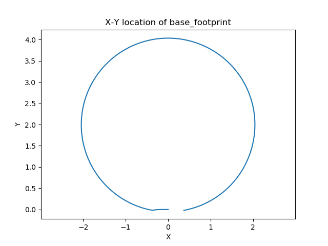
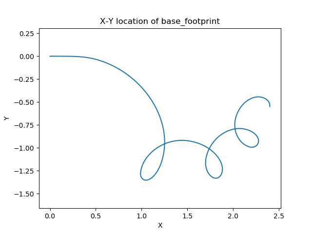
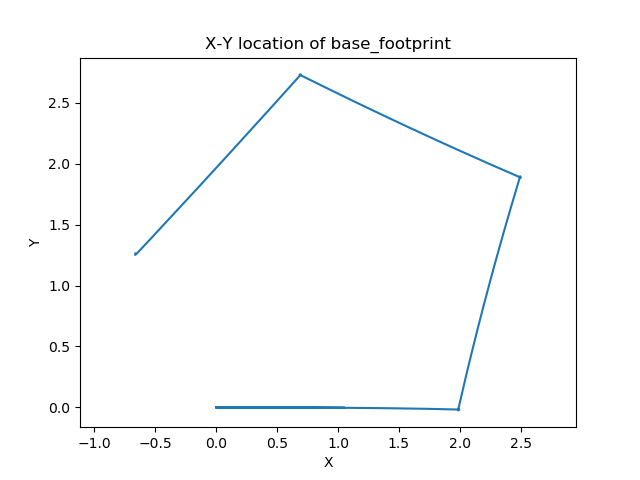
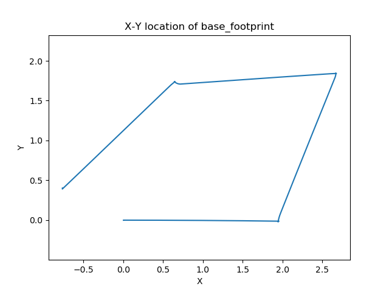
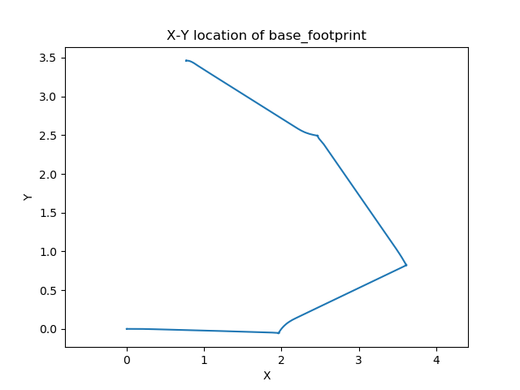

# Results

## Circle, Slow [w=0.1]


[](https://youtu.be/6AAMIuGA4Gg)

## Circle, Normal [w=0.3]


[](https://youtu.be/xuvNKPSpl8k)

## Circle, Fast [w=0.5]


[](https://youtu.be/B_uCSd7c4_c)

## Square, Slow [w=0.1]


[](https://youtu.be/HPHVHBC1qM8)

## Square, Normal [w=0.3]


[](https://youtu.be/vcKnU5jD3Zs)

## Square, Fast [w=0.5]


[](https://youtu.be/VpMnhz8u0oI)

# Prerequisites
Depends on matplotlib python library

```console
sudo apt install python3-pip
python3 -m pip install matplotlib
```
# Launching files
## Circular Trajectory
Launch circular trajectory

```console
roslaunch assignment2b_turtlebot3 move.launch code:='circle'
```

Launch circular trajectory (Slow)

```console
roslaunch assignment2b_turtlebot3 move.launch code:='circle' w:=0.1
```

Launch circular trajectory (Fast)

```console
roslaunch assignment2b_turtlebot3 move.launch code:='circle' w:=0.5
```
## Square Trajectory
Launch square trajectory

```console
roslaunch assignment2b_turtlebot3 move.launch code:='square'
```

Launch square trajectory (Slow)

```console
roslaunch assignment2b_turtlebot3 move.launch code:='square' w:=0.1 v:=0.1
```

Launch square trajectory (Fast)

```console
roslaunch assignment2b_turtlebot3 move.launch code:='square' w:=0.5 v:=0.5
```


